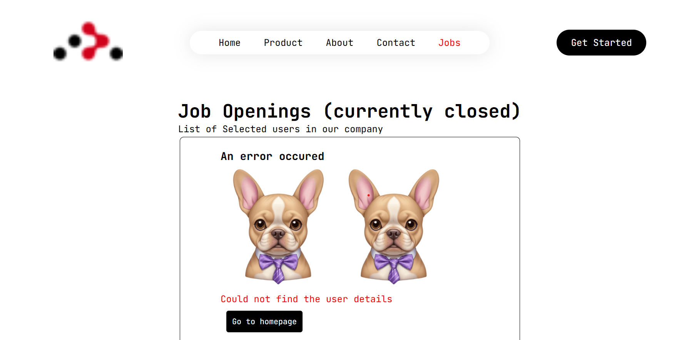

## `React Routing Project`

- This project is designed to help understand routing in React using React Router. It demonstrates how to set up and manage routes in a React application, including dynamic routing, nested routes, and navigation.

## `Features`

- React Router setup
- Navigation using Link and NavLink
- Dynamic route parameters
- Nested routes
- Redirects and error handling
- Custom 404 page

## `images`

  
  

  
  

